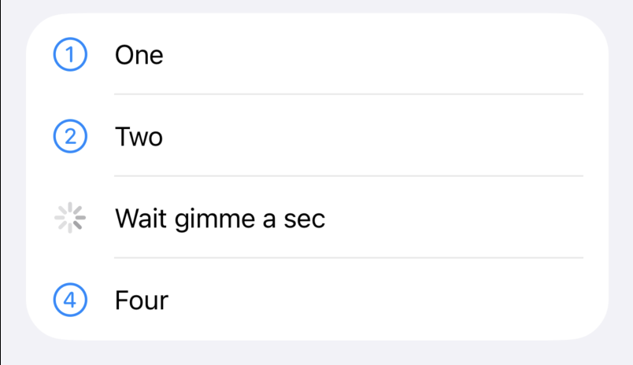
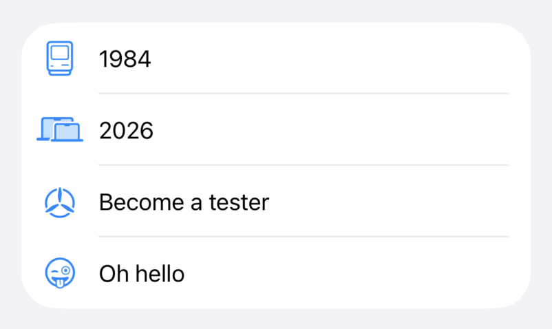
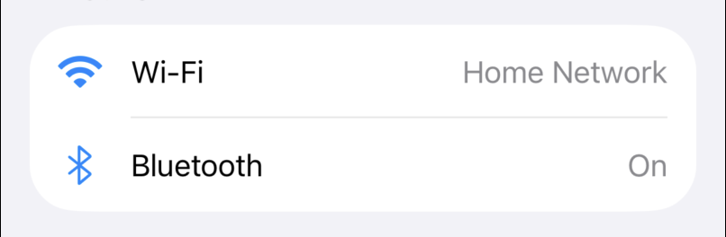
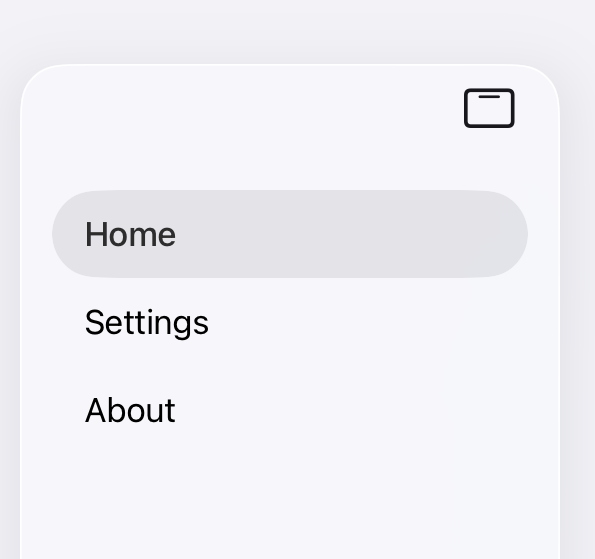

# SwiftUIHelpers

Convenience initializers for SwiftUI views that Apple should have shipped.

## Installation

Add SwiftUIHelpers to your project via Swift Package Manager:
```swift
dependencies: [
    .package(url: "https://github.com/samhenrigold/SwiftUIHelpers.git", from: "1.0.0")
]
```

## Usage

### Label with custom icon view
```swift
Label("Wait gimme a sec") {
    ProgressView()
}
```


### Label with internal system image

Uses private `_internalSystemName:` for SF Symbols not publicly exposed:
```swift
Section {
    Label("1984", internalSystemName: "macintosh.classic")
    Label("2026", systemImage: "macbook.sizes")
    Label("Become a tester", internalSystemName: "apple.testflight")
    Label("Oh hello", internalSystemName: "emoji.face.winking.with.stuck.out.tongue")
}
```



### LabeledContent with system image
```swift
Section {
    LabeledContent("Wi-Fi", systemImage: "wifi") {
        Text("Home Network")
    }

    LabeledContent("Bluetooth", internalSystemName: "bluetooth") {
        Text("On")
    }
}
```



### Tab with text-only labels

Available on iOS 18 and aligned releases (2024):
```swift
TabView {
    Tab("Home", value: .home) {
        HomeView()
    }
    
    Tab("Settings", value: .settings) {
        SettingsView()
    }
    
    Tab("About", value: .about) {
        AboutView()
    }
}
```



### Static transform for compile-time conditions

Apply different modifiers based on availability checks, compiler directives, or build configuration:
```swift
Button("Sign In") { }
.staticTransform { view in
    if #available(iOS 26.0, *) {
        view.buttonStyle(.glass)
    } else {
        view.buttonStyle(.bordered)
    }
}
```

> [!WARNING]
> `staticTransform` is designed exclusively for compile-time conditions. Do not use it as a general-purpose conditional modifier with runtime state (`@State`, `@Binding`, computed properties, etc.). Doing so will break view identity and cause performance issues. For runtime conditionals, use standard SwiftUI patterns like `Group` with `if` statements.

## License

MIT
